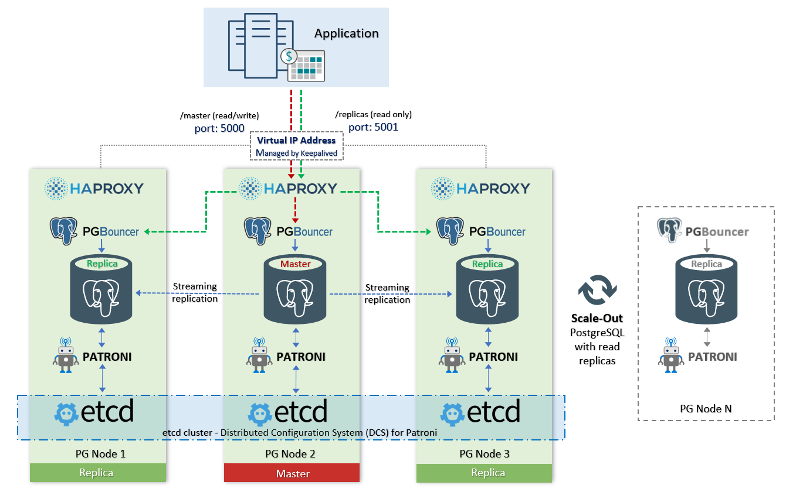

# PostgreSQL High-Availability Cluster on Oracle Cloud INfrastructure (OCI) :elephant: :sparkling_heart:
### PostgreSQL High-Availability Cluster (based on "Patroni" and "DCS(etcd)"). Automating deployment on OCI using Terraform.

This Terraform module is designed for deploying a PostgreSQL high availability cluster on OCI enviropnment for a production environment. Terraform creates the infrastructure, builds the inventory and the other necessary variable files automatically for ansible to deploy the high available cluster.

> :heavy_exclamation_mark: Please test it in your test enviroment before using in a production.

## Acknowledgement: 
Folks who contributed with code, feedback, ideas, testing etc:
-  Jeet Jagasia
-  Vitaliy Kukharik

### PostgreSQL High-Availability with Load Balancing - Architecture


This environment provides the ability to distribute the load on reading. This also allows us to scale out the cluster (with read-only replicas).

- port 5000 (read / write) master
- port 5001 (read only) all replicas

###### if variable "synchronous_mode" is 'true':
- port 5002 (read only) synchronous replica only
- port 5003 (read only) asynchronous replicas only

> :heavy_exclamation_mark: Your application must have support sending read requests to a custom port (ex 5001), and write requests (ex 5000).

##### Components of high availability:
[**Patroni**](https://github.com/zalando/patroni) is a template for you to create your own customized, high-availability solution using Python and - for maximum accessibility - a distributed configuration store like ZooKeeper, etcd, Consul or Kubernetes. Used for automate the management of PostgreSQL instances and auto failover.

[**etcd**](https://github.com/etcd-io/etcd) is a distributed reliable key-value store for the most critical data of a distributed system. etcd is written in Go and uses the [Raft](https://raft.github.io/) consensus algorithm to manage a highly-available replicated log. It is used by Patroni to store information about the status of the cluster and PostgreSQL configuration parameters.

[What is Distributed Consensus?](http://thesecretlivesofdata.com/raft/)

##### Components of load balancing:
[**HAProxy**](http://www.haproxy.org/) is a free, very fast and reliable solution offering high availability, load balancing, and proxying for TCP and HTTP-based applications. 

[**confd**](https://github.com/kelseyhightower/confd) manage local application configuration files using templates and data from etcd or consul. Used to automate HAProxy configuration file management.

[**Keepalived**](https://github.com/acassen/keepalived) provides a virtual high-available IP address (VIP) and single entry point for databases access.
Implementing VRRP (Virtual Router Redundancy Protocol) for Linux.
In our configuration keepalived checks the status of the HAProxy service and in case of a failure delegates the VIP to another server in the cluster.

[**PgBouncer**](https://pgbouncer.github.io/features.html) is a connection pooler for PostgreSQL.


---
## Compatibility
RedHat and Debian based distros (x86_64)

###### Minimum OS versions:
- Oracle Enterprise Linux: 7
- RedHat: 7
- CentOS: 7

:white_check_mark: tested, works fine: `OEL 7.5/7.6/7.7 CentOS 7.6`

###### PostgreSQL versions: 
all supported PostgreSQL versions

:white_check_mark: tested, works fine: `PostgreSQL 9.6, 10, 11, 12`

###### Terraform version
This module is tested on Terraform v0.12.6. Pleae note that this module is not compatible with older (.11x) versions.

###### Terraform OCI Provider version
Tested with OCI terraform provider v3.46.0. 

###### Ansible version 
This has been tested on Ansible 2.7.10 and higher.


## Prerequisites
1. [Download and install Terraform](https://www.terraform.io/downloads.html) (v0.12.6 or later v0.12.X versions)
2. Export OCI credentials using guidance at [Export Credentials](https://www.terraform.io/docs/providers/oci/index.html).
You must use an Admin User account to launch this terraform environment. You may update the credentials in env-vars.sh file and run it to set environment variables for this setup.
3. The tenancy used for provisoning must have service limits increased to accomodate the build. 
4. Create or choose existing Regional Public Subnet where Bastion node and Regional Private Subnet where Postgresql nodes are to be launched.

> :This module does not create the VCN/Subnets or other components to match real life requirements and you are expected to have an existing functional VCN where you already have your other resources running.

Refer the link [here](https://github.com/oracle/oci-quickstart-prerequisites) for detailed instructions on setting up terraform.


## How to use this module?
1. Download or clone this repository
```
git clone https://github.com/jayakrishnanl/PostgresPatroniCluster.git`
```

2. Go to the module directory
```
cd PostgresPatroniCluster>
```

3. Update [env-vars.sh](./env-vars.sh) with OCI Credentials. Windows uses checkout [env-vars.ps1](./env-vars.ps1) file. This file defines environment variables with credentials for your Oracle Cloud Infrastructure tenancy.

4. Review and edit the variables files - [variables.tf](./variables.tf) & [variables.tfvars](./variables.tfvars)

> :heavy_exclamation_mark: Comment out the default dummy passwords mentioned in [variables.tf](./variables.tf) and do not store it on [variables.tfvars](./variables.tfvars) rather type in the password on run time. I also suggest to use remote state store so that terrafrom does not keep the passwords locally. 

5. Set environment variables by running **source env-vars.sh** on your \*NIX system. Checkout **env-vars.ps1** on your Windows systems.
  ```
  $ source env-vars.sh
  ```

6. Initialize Terraform. This will also download the latest terraform oci provider.
  ```
  $ terraform init
  ```

7. Run terraform apply to create the infrastructure:
  ```
  $ terraform apply
  ```

When you’re prompted to confirm the action, enter **yes**.

8. If you want to delete the infrastructure, run:
  ```
  $ terraform destroy
  ```

When you’re prompted to confirm the action, enter **yes**.

## Learn more about the components used here:
- [Tutorial: Management of High-Availability PostgreSQL clusters with Patroni](https://pgconf.ru/en/2018/108567)
- [Patroni documentation](https://patroni.readthedocs.io/en/latest/)
- [etcd operations guide](https://etcd.io/docs/v3.3.12/op-guide/)


## Disclaimer
This is my personal GitHub project, the ideas expressed here do not represent my employer's point of view... Likewise the exact opposite is also definitely true!


